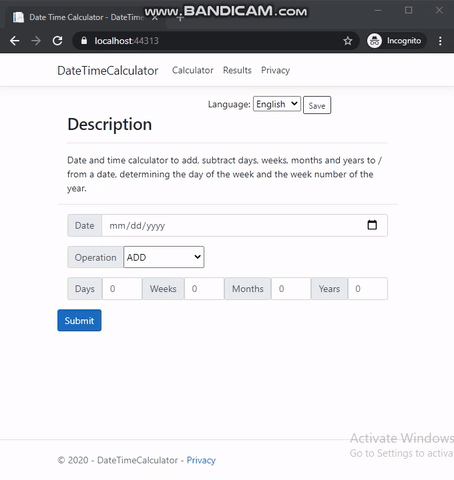

# Date Time Calculator - .NET MVC Webapp

## About
Date Time Calculator web application using *Asp.Net MVC* to perform operations on dates and to store and retrieve results.

## Features

### Operations
  
* Add/Subtract days, weeks, months, year from date.
* Determine day of the week from date.
* Get week number of the year from given date
     

* * *
    
	 
### All Results 
     
* Get all results of all operations from underlying **postgres DB**
	 

* * *
	 
### Session Results 

* Get results for current session   

* * *

### Filter Results 

* Filter results by operation

* * *

### Download Results 

* Download results as *CSV* file
	 

* * *

### Multiple Language Support  

* Support for l10n and i18n
* Currently supporting **English** and **Spanish**
	 

